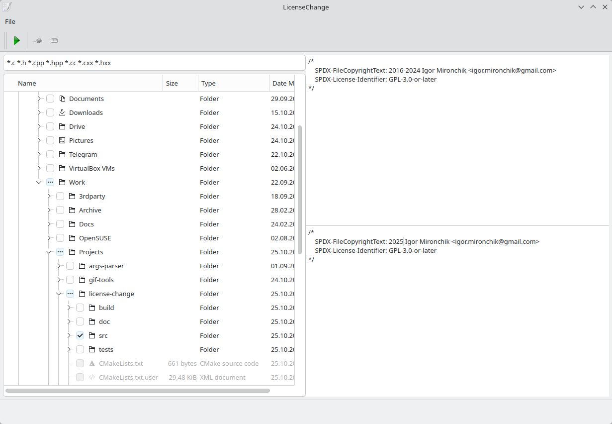
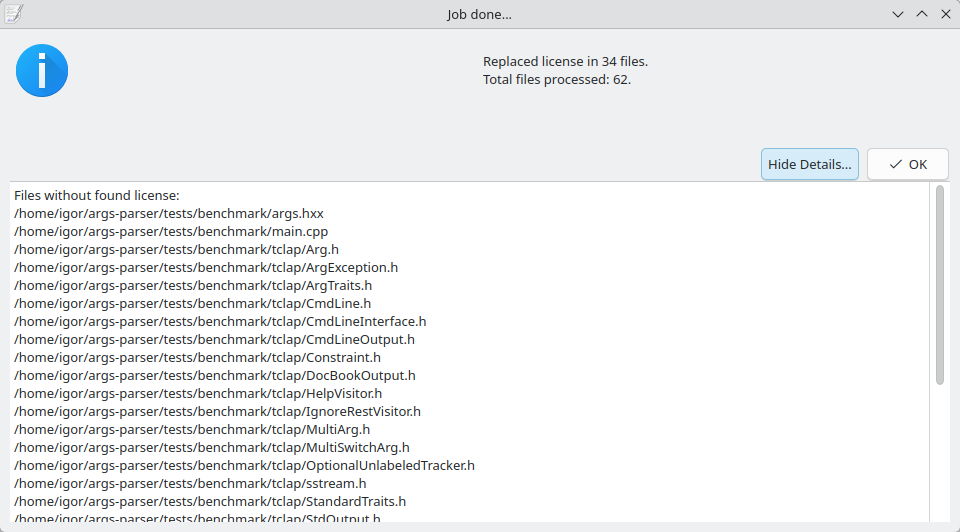

LicenseChange is a GUI application that find license in text files and changes it to the
new one.

* Find a license algorithm works without accounting space characters, i.e. it
does not matter how much spaces or tabs will be between words.
* UI of the application allows to put macro to represent any word or a line in a searchable license.
* Find algorithm can work case-sensitive or no.
* Find algorithm can stop processing of a file on first found license
(that can improve performance on big files with one license at the beginning), or can
replace every occurrence of a license in a file.
* After processing of files user sees a dialogue with information about processed/unprocessed
files with comfortable detailed information about unprocessed files.
* User can specify a wildcard for file extensions for processing.
* User can select folders for processing directly in the UI (thanks to Andre Somers
andre@familiesomers.nl) with his `CheckableProxyModel`.
* With processing a large set of files user will see a progress bar with progress and he
can abort this process in status bar at any moment.

